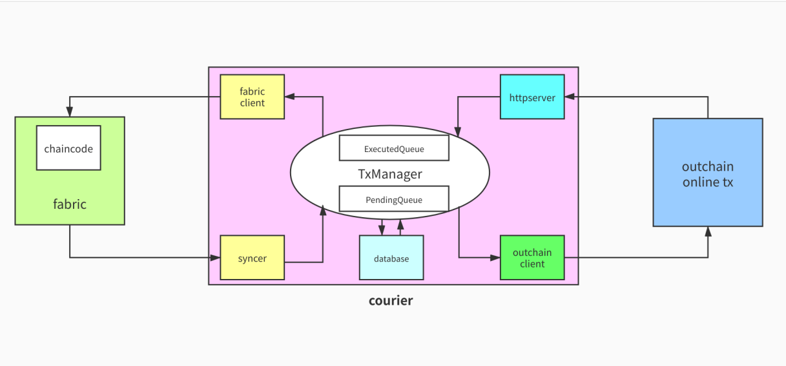

#### Courier ——  fabric跨链中间件


- 六大组件

    
    (1): syncer——通过fabric clietn同步相应的Block,解析出待处理的Transaction，并封装为CrossTx提交到txmanager
    
    (2): txmanager——courier核心结构，主要功能是管理CrossTx
    
    (3): database——由嵌入式关系型数据库Storm实现txmanager数据的存储
    
    (4): outchain client——通过outchain client将CrossTx上传到outchain
    
    (5): httpserver——接收outchain 返回的交易回执(如outchain的Txid)
    
    (6): fabric client——通过fabric client 同步Block，并根据outchain的交易回执，发起fabric 合约交易。


- 跨链交易状态


- CrossTx流程

  - (1) 调用chaincode中的precommit函数, 交易状态设置为`Init`,触发precommit event
  - (2) syncer同步并解析block中的交易, 过滤后封装成CrossTx提交给txmanager
  - (3) txmanager 将接收到的CrossTx先存入database,再发送给outchain,成功后将交易状态从`Init`更新为`Pending`并存入database
  - (4) outchain接收到CrossTx后,按照courier和outchain的约定处理
  - (5) httpserver接收到outchain处理完CrossTx交易后的交易回执,将交易状态从`Pending`更新为`Executed`
  - (6) fabric client将CrossTx在outchain上的交易回执提交给chaincode的commit函数
  - (7) chaincode commit函数 将交易状态更新为`Finished`, 触发commit event
  - (8) syncer同步并解析block中的交易,过滤后,将对应CrossID的交易状态更新为`Completed`
  - (9) 交易状态为`Completed`,意味着fabric两阶段跨链交易完成
    

#### 测试

- (1)  复制fabric 1.4.2 tools, 启动fabric v1.4.2测试网.基于 [hyperledger fabric-samples](https://github.com/hyperledger/fabric-samples) v1.4.2
```bash
cd first-network
sudo cp ./bin/* /usr/local/bin 
./byfn.sh up
```
  用`./byfn.sh down`关闭,更多功能`./byfn.sh --help`


- (2) 启动courier
```bash
cd cmd/courier
go build
mkdir courier_data
./courier --ccid=mycc --config ../../config/org1sdk-config.yaml  --cid mychannel --peer 'grpcs://localhost:7051'
```

- (3) 通过fabric-cli发起fabric交易
```bash
cd fabric-cli
go build
./fabric-cli chaincode query --cid mychannel --ccid mycc --args '{"Func":"query","Args":["a"]}' --peer grpcs://localhost:7051 --payload --config ../config/org1sdk-config.yaml
./fabric-cli chaincode invoke --cid mychannel --ccid=mycc --args '{"Func":"precommit","Args":["sipc-address","100","如果给a的sipc-addresss转账1sipc, 那么a将给b转10个coin","invoke","a b 10"]}' --peer grpcs://localhost:7051 --base64 --config ../config/org1sdk-config.yaml
```
更多[fabric-cli命令](./fabric-cli/README.md)
- (4) 观察courier日志, 复制相应的CrossID(如`99bfceec0facc9126f164c7aa55d43a4834fbe1c5ed3e76059d9d283ad926552`),手动模拟outchain传回交易回执
```bash
curl -d "crossid=99bfceec0facc9126f164c7aa55d43a4834fbe1c5ed3e76059d9d283ad926552&receipt=99bfceec0facc9126f164c7aa55d43a4834fbe1c5ed3e76059d9d283ad926552&sequence=1001" http://localhost:8080/v1/receipt -X "POST"
```

- (5) 通过fabric-cli查询
```bash
./fabric-cli chaincode query --cid mychannel --ccid mycc --args '{"Func":"query","Args":["a"]}' --peer grpcs://localhost:7051 --payload --config ../config/org1sdk-config.yaml
```
